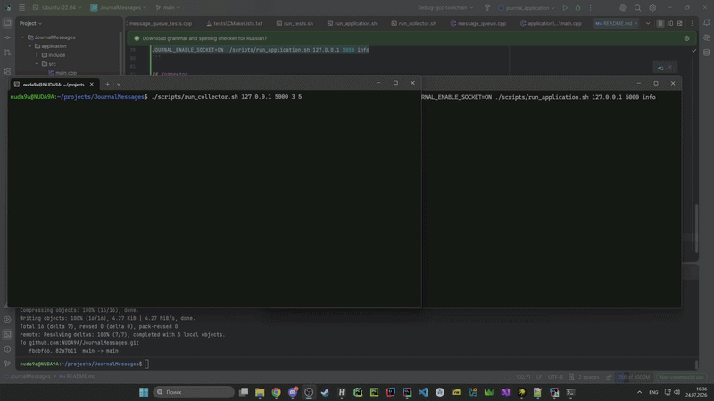

# JournalMessages

Библиотека журналирования, консольное приложение для отправки сообщений и дополнительный TCP-коллектор статистики.

Библиотека собирается в двух вариантах:

- `JournalMessages::Static`;
- `JournalMessages::Shared`.

## Зафиксированные контракты

- Поддерживаются уровни `info`, `warning` и `error`; при разборе регистр не учитывается.
- Порядок важности: `info < warning < error`. Сообщения ниже текущего порога не записываются.
- Если уровень сообщения не указан, используется текущий уровень по умолчанию. Его можно изменить во время работы приложения.
- `FileJournal` открывает файл в режиме добавления и не удаляет существующие записи.
- Формат строки файла:

  ```text
  [YYYY-MM-DD HH:MM:SS] [LEVEL] message
  ```

- Сообщения приложения передаются потоку записи через FIFO-очередь. При завершении уже поставленные в очередь команды обрабатываются до остановки потока.
- `SocketJournal` и `JournalCollector` взаимодействуют по TCP/IPv4. Коллектор необходимо запустить до подключения `SocketJournal`.
- Коллектор обслуживает одного клиента за один запуск и принимает сообщения длиной не более 1024 байт.
- `N` задаёт периодический вывод статистики по числу сообщений, `T` — таймаут вывода изменившейся статистики в секундах.

## Требования

Для запуска скриптов необходимы:

- Linux;
- GCC;
- CMake;
- Ninja.

Перед первым запуском:

```bash
chmod +x scripts/run_tests.sh scripts/run_application.sh scripts/run_collector.sh
```

## Тесты

Сборка и запуск тестов статической и динамической библиотек:

```bash
./scripts/run_tests.sh
```

По умолчанию socket-поддержка включена. Запуск без socket-тестов:

```bash
JOURNAL_ENABLE_SOCKET=OFF ./scripts/run_tests.sh
```

## Приложение

Запись сообщений в файл:

```bash
./scripts/run_application.sh <log_file> <default_log_level>
```

Пример:

```bash
./scripts/run_application.sh ./journal.log info
```

Подключение приложения к коллектору:

```bash
JOURNAL_ENABLE_SOCKET=ON ./scripts/run_application.sh <ip_address> <port> <default_log_level>
```

Пример:

```bash
JOURNAL_ENABLE_SOCKET=ON ./scripts/run_application.sh 127.0.0.1 5000 info
```

## Коллектор

```bash
./scripts/run_collector.sh <ip_address> <port> <N> <T>
```

Пример:

```bash
./scripts/run_collector.sh 127.0.0.1 5000 3 5
```

## Демонстрация SocketJournal и JournalCollector


